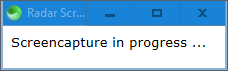

# Radar Screencapture

Take a screenshot of screen every second, and save it as a `.png` image if it contains a red pixel.

## Preview

## Building

1. Download whichever `sciter` library corresponds to your operating system from [this](https://github.com/c-smile/sciter-sdk) repository.

On Windows x64, for instance, it would be located in `https://github.com/c-smile/sciter-sdk/tree/master/bin.win/x64` and would be named `sciter.dll`.

2. Plop it into the same folder with the contents of this repository.

3. Create a folder named `unique_screenshots` in this same folder.

4. Ensure the Rust toolchain is installed and run `cargo run --release`.

## Usage

Adjust the sliders to control the thresholds to determine how "red" a pixel must be to trigger a screenshot.
  
- The pixel's red value must be AT LEAST as great as the red slider.
- The pixel's green and blue values must be LESS THAN (or equal to) the green and blue sliders.
- To be so specific that only a perfectly red pixel `rgb(255, 0, 0)` triggers a screenshot, leave slider values as-is.

## Why?

[This](https://old.reddit.com/r/software/comments/jj1ecv/software_to_take_screenshots_when_there_are/) Reddit thread.
