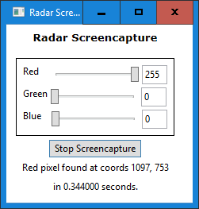

# Radar Screencapture

Take a screenshot of screen every second, and save it as a `.png` image if it's not a pixel-perfect duplicate of the previous screenshot.

## Preview

## Instructions

1. Download whichever `scapp` executable corresponds to your operating system from [this](https://github.com/c-smile/sciter-sdk) repository.

On Windows x64, for instance, it would be located in `https://github.com/c-smile/sciter-sdk/tree/master/bin.win/x64` and would be named `scapp.exe`.

2. Plop it into the same folder with the contents of this repository.

3. Run it!

## Notes

Only tested on Windows x64.  The pathnames used in `main.htm` and `script.tis` may or may not need to be revised to be compatible with other operating systems.